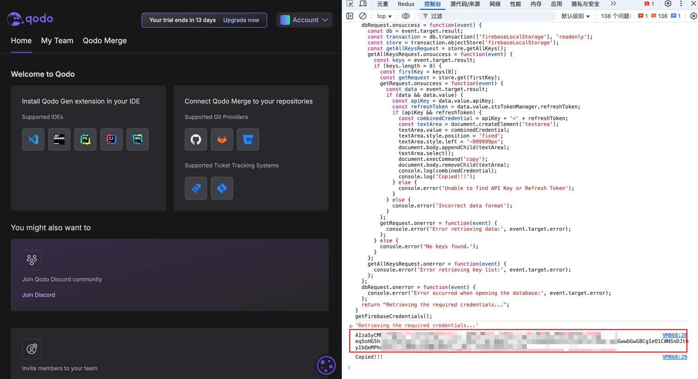

<p align="right">
   <strong>中文</strong> 
</p>
<div align="center">

# qodo2api

_觉得有点意思的话 别忘了点个 ⭐_

<a href="https://t.me/+LGKwlC_xa-E5ZDk9">
    
    <span style="text-decoration: none; font-size: 12px; color: #0088cc; vertical-align: middle;">Telegram 交流群</span>
</a>

<sup><i>(原`coze-discord-proxy`交流群, 此项目仍可进此群**交流** / **反馈bug**)</i></sup>
<sup><i>(群内提供公益API、AI机器人)</i></sup>

</div>

## 功能

- [x] 支持对话接口(流式/非流式)(`/chat/completions`),详情查看[支持模型](#支持模型)
- [x] 支持自定义请求头校验值(Authorization)
- [x] 支持cookie池(随机),详情查看[获取cookie](#cookie获取方式)
- [x] 支持请求失败自动切换cookie重试(需配置cookie池)
- [x] 可配置代理请求(环境变量`PROXY_URL`)

### 接口文档:

略

### 示例:

略

## 如何使用

略

## 如何集成NextChat

略

## 如何集成one-api

略

## 部署

### 基于 Docker-Compose(All In One) 进行部署

```shell
docker-compose pull && docker-compose up -d
```

#### docker-compose.yml

```docker
version: '3.4'

services:
  qodo2api:
    image: deanxv/qodo2api:latest
    container_name: qodo2api
    restart: always
    ports:
      - "10022:10022"
    volumes:
      - ./data:/app/qodo2api/data
    environment:
      - QD_COOKIE=******  # cookie (多个请以,分隔)
      - API_SECRET=123456  # [可选]接口密钥-修改此行为请求头校验的值(多个请以,分隔)
      - TZ=Asia/Shanghai
```

### 基于 Docker 进行部署

```docker
docker run --name qodo2api -d --restart always \
-p 10022:10022 \
-v $(pwd)/data:/app/qodo2api/data \
-e QD_COOKIE=***** \
-e API_SECRET="123456" \
-e TZ=Asia/Shanghai \
deanxv/qodo2api
```

其中`API_SECRET`、`QD_COOKIE`修改为自己的。

如果上面的镜像无法拉取,可以尝试使用 GitHub 的 Docker 镜像,将上面的`deanxv/qodo2api`替换为
`ghcr.io/deanxv/qodo2api`即可。

### 部署到第三方平台

<details>
<summary><strong>部署到 Zeabur</strong></summary>
<div>

[](https://zeabur.com?referralCode=deanxv&utm_source=deanxv)

> Zeabur 的服务器在国外,自动解决了网络的问题,~~同时免费的额度也足够个人使用~~

1. 首先 **fork** 一份代码。
2. 进入 [Zeabur](https://zeabur.com?referralCode=deanxv),使用github登录,进入控制台。
3. 在 Service -> Add Service,选择 Git（第一次使用需要先授权）,选择你 fork 的仓库。
4. Deploy 会自动开始,先取消。
5. 添加环境变量

   `QD_COOKIE:******`  cookie (多个请以,分隔)

   `API_SECRET:123456` [可选]接口密钥-修改此行为请求头校验的值(多个请以,分隔)(与openai-API-KEY用法一致)

保存。

6. 选择 Redeploy。

</div>


</details>

<details>
<summary><strong>部署到 Render</strong></summary>
<div>

> Render 提供免费额度,绑卡后可以进一步提升额度

Render 可以直接部署 docker 镜像,不需要 fork 仓库：[Render](https://dashboard.render.com)

</div>
</details>

## 配置

### 环境变量

1. `PORT=10022`  [可选]端口,默认为10022
4. `QD_COOKIE=******`  cookie (多个请以,分隔)
3. `API_SECRET=123456`  [可选]接口密钥-修改此行为请求头(Authorization)校验的值(同API-KEY)(多个请以,分隔)
3. `CHINESE_CHAT_ENABLED=true`  [可选]官方限制中文对话,如需中文多轮对话可开启此项尝试破限。(默认:true)[true:打开、false:关闭]
2. `DEBUG=true`  [可选]DEBUG模式,可打印更多信息[true:打开、false:关闭]
6. `PROXY_URL=http://127.0.0.1:10801`  [可选]代理
5. `REQUEST_RATE_LIMIT=60`  [可选]每分钟下的单ip请求速率限制,默认:60次/min
7. `ROUTE_PREFIX=hf`  [可选]路由前缀,默认为空,添加该变量后的接口示例:`/hf/v1/chat/completions`
8. `RATE_LIMIT_COOKIE_LOCK_DURATION=600`  [可选]到达速率限制的cookie禁用时间,默认为60s

### cookie获取方式

1. 打开[qodo](https://app.qodo.ai/signin)并登录。
2. 登录成功后打开[qodo](https://app.qodo.ai)
3. 打开**F12**开发者工具。
4. 右侧开发者工具-控制台，执行如下代码。
```
function getFirebaseCredentials() {
  const dbRequest = indexedDB.open('firebaseLocalStorageDb');
  dbRequest.onsuccess = function(event) {
    const db = event.target.result;
    const transaction = db.transaction(['firebaseLocalStorage'], 'readonly');
    const store = transaction.objectStore('firebaseLocalStorage');
    const getAllKeysRequest = store.getAllKeys();
    getAllKeysRequest.onsuccess = function(event) {
      const keys = event.target.result;
      if (keys.length > 0) {
        const firstKey = keys[0];
        const getRequest = store.get(firstKey);
        getRequest.onsuccess = function(event) {
          const data = event.target.result;
          if (data && data.value) {
            const apiKey = data.value.apiKey;
            const refreshToken = data.value.stsTokenManager.refreshToken;
            if (apiKey && refreshToken) {
              const combinedCredential = apiKey + '=' + refreshToken;
              const textArea = document.createElement('textarea');
              textArea.value = combinedCredential;
              textArea.style.position = 'fixed';
              textArea.style.left = '-999999px';
              document.body.appendChild(textArea);
              textArea.select();
              document.execCommand('copy');
              document.body.removeChild(textArea);              
              console.log(combinedCredential);
              console.log('Copied!!!');
            } else {
              console.error('Unable to find API Key or Refresh Token');
            }
          } else {
            console.error('Incorrect data format');
          }
        };        
        getRequest.onerror = function(event) {
          console.error('Error retrieving data:', event.target.error);
        };
      } else {
        console.error('No keys found.');
      }
    };    
    getAllKeysRequest.onerror = function(event) {
      console.error('Error retrieving key list:', event.target.error);
    };
  };  
  dbRequest.onerror = function(event) {
    console.error('Error occurred when opening the database:', event.target.error);
  };  
  return "Retrieving the required credentials...";
}
getFirebaseCredentials();
```
<span></span>

5. 打印的值即所需cookie值,即环境变量`QD_COOKIE`,无需手动复制,会自动复制到粘贴板。

## 进阶配置

略

## 支持模型

新用户注册即可获赠**14**天试用。

| 模型名称              |
|-------------------|
| claude-3-7-sonnet |
| claude-3-5-sonnet |
| deepseek-r1       |
| deepseek-r1-32b   |
| gpt-4o            |
| o1                |
| o3-mini           |
| o3-mini-high      |
| gemini-2.5-pro    |
| gemini-2.0-flash  |

## 报错排查

> `Detected that you are using Chinese for conversation, please use English for conversation.`

官方限制了中文对话,如需中文多轮对话可开启环境变量`CHINESE_CHAT_ENABLED`尝试破限。

> `输出URL编码的内容`

出现此场景的情况一般是开启了环境变量`CHINESE_CHAT_ENABLED`,某些模型指令遵循较差,无解。

## 其他

略